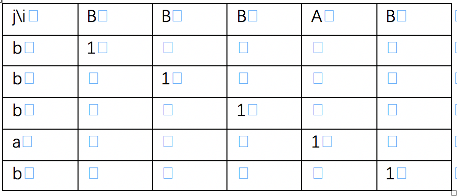
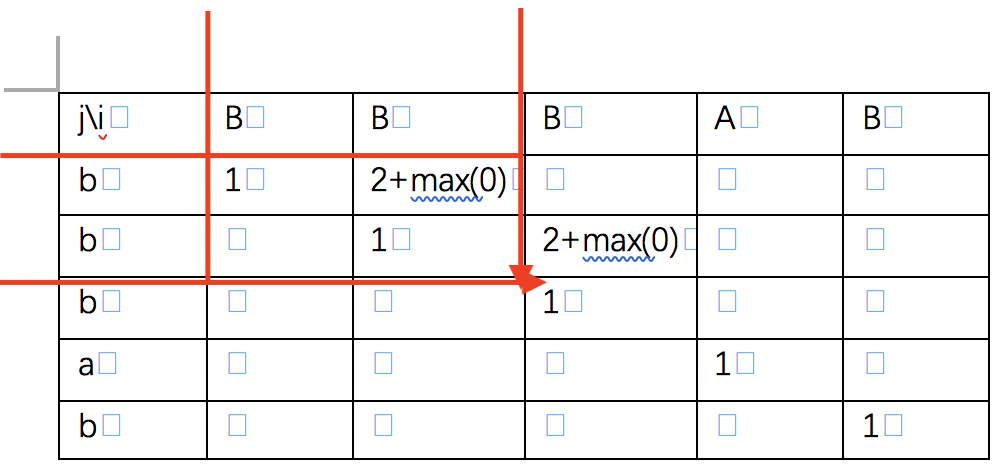
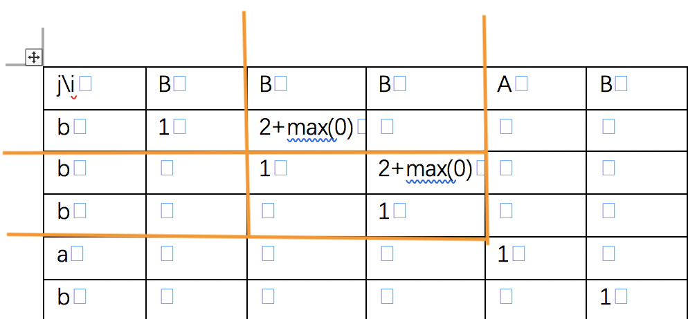
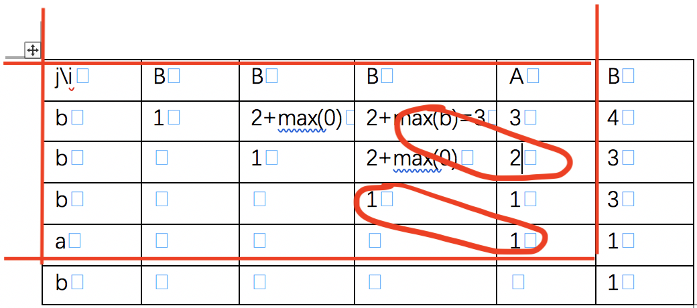
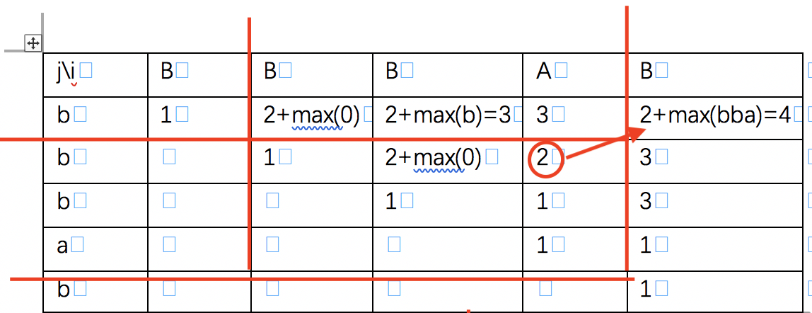

# 516.最长的回文子序列

给定一个字符串s，找到其中最长的回文子序列。可以假设s的最大长度为1000。

示例 1:
输入:

"bbbab"
输出:

4
一个可能的最长回文子序列为 "bbbb"。

示例 2:
输入:

"cbbd"
输出:

2
一个可能的最长回文子序列为 "bb"。

## JAVA代码  

思路：
####1  要需要区分的是最长回文子序列，和最长回文子串：
例1:bbbab的最长回文子串是bab，最长回文子序列是bbbb，从正序出发可得到一个序列是bbbb，从反序出发拿到第五个位置b，然后跳过第四个位置a，获取前面的三个b，得到序列也bbbb，与正序相同，所以最长回文子序列是bbbb
####2.需要动态规划的思路。可以通过递归方式，或两层的for循环来实现。
先使用两层for循环的方式，通过图文的方式，详细说明一下代码的实现逻辑。
通过一个二位矩阵来保存，每次循环计算多的最长回文序列的长度。
以bbbab为例：
b(x)b是要计算的子串，目标是获取到max(b(x)b) 的最长序列。
然后比较str.charAt(0)与str.charAt(str.length-1)是否相等，
1.如果相等 那么可以先确定 最长序列是2+max(x), x子串中的最长序列加上左右连个位置的b。
2.如果不相等。那么思路可以换做为获取max(  max(b(x)),max((x)b) )的最长序列
分别计算第一个位置的 b与（X）的组合序列  和（X）与最后一个位置B的最长序列，并在最终的两个结果中，去最大。
3.然后 max（x）重复上面的流程，获取max（X）中的最长序列。
通过图解的方式，来说明一下代码的流程。


比较最大值的循环中，当比较相同位置的字母是最大长度为1，
表格中最终的比较结果是按照对角线成对称的，所以只需要比较其中一半的结果就可以，减少一半的计算量。



分别比较上图两个位置的矩阵，按照相同获取2+max（x）的规则，得出对应位置的最大序列。


如是比较到bbb子串，前后是相同的使用到2+max（b），寻找在绿色位置的矩阵记录的最大值为1，就是2+1=3 是bbb的最大序列。


上面比较过程是按照反序进行，先是a，然后是ab，abb，abbb，这个顺序获取bbba的最长序列，


首先a位置，自身比较最长序列位1
ab比较，不相等，使用到max（max(a),max(b)）,图中所圈中的连个位置中的最大值。
依次进行，最终这个abbb的矩阵中最长序列是3.


在最终的bbbab子串比较到最后位置，整个矩阵的右上角时，B与b相同，就是2+max（bba），然后看到bba矩阵的最大值为2，
最终结果bbbab的最长序列为4.


```Java
class Solution {
public int longestPalindromeSubseq(String s) {
if (s == null || s.length() == 0) return 0;
if(s.length()==1) return 1;

char[] chars = s.toCharArray();
if(s.length()==2) return chars[0] == chars[1] ? 2 : 1;

int[] array = new int[s.length()];
int maxmid = 0;
for (int i = 0; i < s.length(); i ++) {
array[i] = 1;
maxmid = 0;
for (int j = i - 1; j > -1; j --) {
int temp = array[j];
if (chars[i] == chars[j]) {
array[j] = 2 + maxmid;
}
maxmid = Math.max(maxmid, temp);
}
}
for (int num : array) {
maxmid = Math.max(maxmid, num);
}
return maxmid;

}
}
```

```python
class Solution:
def longestPalindromeSubseq(self, s):
"""
:type s: str
:rtype: int
"""
if s is None:return 0

length = len(s)
if length == 0 or length == 1 or s == s[::-1]:
return length

p = [[0] * length for i in range(length)]  # p[(i,j)] denotes the length of the palindromic subsequence in the range from i to j.

for j in range(0, length):
p[j][j] = 1
for i in reversed(range(0, j)):
if s[i] == s[j]:
p[i][j] = p[i + 1][j - 1] + 2
else:
p[i][j] = max(p[i + 1][j], p[i][j - 1])
# maxlen = max(maxlen, p[(i, j)])

return p[0][length - 1]
```
